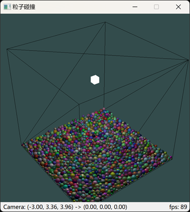
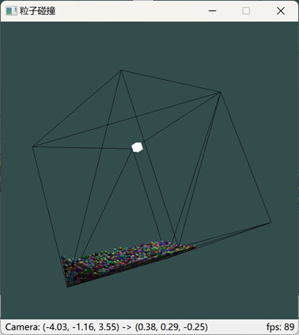

# Particles

粒子碰撞仿真。

## 编译方式

用VS2022打开`Particles.sln`，编译即可。

VS扩展：

```
Qt VS Tools
```

依赖库：

```
QT 6.4.2
CUDA Toolkit 11.8
```

配置环境变量：

```
QT_MSVC_PAHT
```

## 效果展示

旋转前：



旋转后：



## 交互方法

- `W、A、S、D、F、B`：上、左、下、右、前、后
- `Z、X`：放大、缩小
- `R`：重新下落
- 鼠标：拖动旋转、滚轮缩放
